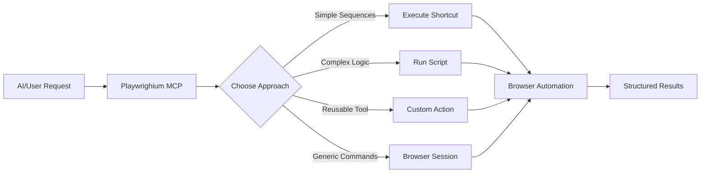

# Overview - What is Playwrighium?

Playwrighium is a Model Context Protocol (MCP) server that bridges AI automation with reusable browser workflows. Instead of having AI generate individual browser steps each time, you define tested, reusable automation components that AI can intelligently select and execute.

## 🎯 The Core Problem

**Traditional AI Automation Issues:**
- AI regenerates the same steps repeatedly → inconsistent results
- Complex workflows require perfect step-by-step generation → error-prone
- No reusability → same login flows recreated every time
- No version control → automation knowledge lost

**Traditional Playwright Issues:**
- Requires deep technical knowledge → high barrier to entry
- No standardization → everyone builds their own patterns
- Hard to share workflows → knowledge silos

## 💡 The Playwrighium Solution

Playwrighium introduces three complementary automation approaches:

### 1. **Custom Actions** (TypeScript)
Reusable tools that expose specific automation capabilities as MCP tools.

```typescript
// .playwright-mcp/actions/login-to-staging.ts
const action: PlaywrightActionDefinition = {
  name: 'login-to-staging',
  description: 'Login to our staging environment',
  inputSchema: z.object({
    role: z.enum(['admin', 'user']).optional()
  }),
  async run({ page, input, logger }) {
    // Your tested login logic here
    await page.goto(process.env.STAGING_URL);
    // ... login implementation
    return { message: 'Successfully logged in' };
  }
};
```

### 2. **Shortcuts** (YAML)
Simple, declarative command sequences for common workflows.

```yaml
# .playwright-mcp/shortcuts/navigate-to-reports.yaml
commands:
  - type: navigate
    url: ${{APP_URL}}/reports
  - type: wait_for_text
    text: "Reports Dashboard"
  - type: screenshot
    path: "reports-loaded.png"
```

### 3. **Scripts** (TypeScript/JavaScript)
Advanced automation logic with full programming capabilities.

```typescript
// .playwright-mcp/scripts/extract-user-data.ts
export default async function({ page, logger }) {
  const users = await page.evaluate(() => {
    return Array.from(document.querySelectorAll('.user-row'))
      .map(row => ({
        name: row.querySelector('.name').textContent,
        email: row.querySelector('.email').textContent
      }));
  });
  return { users, count: users.length };
}
```

## 🔄 How It Works



## 🎯 Key Benefits

### For AI Agents
- **Consistent Results**: Pre-tested workflows eliminate variability
- **Faster Execution**: No need to generate steps, just select tools
- **Better Context**: Rich descriptions help AI choose the right tool
- **Structured Output**: Predictable result formats for chaining

### For Developers
- **Reusability**: Write once, use everywhere
- **Version Control**: Track automation changes over time
- **Team Sharing**: Standardized automation across team
- **Gradual Complexity**: Start simple, add complexity as needed

### For Organizations
- **Standardization**: Consistent automation patterns
- **Knowledge Capture**: Institutional automation knowledge preserved
- **Maintenance**: Update automation logic in one place
- **Security**: Centralized secret management

## 🏗️ Architecture Layers

### 1. **MCP Server Layer**
- Discovers and loads actions/shortcuts/scripts
- Handles MCP protocol communication
- Manages browser lifecycle and persistence
- Provides logging and error handling

### 2. **Automation Layer**
- **Built-in Actions**: Core browser automation primitives
- **Custom Actions**: User-defined automation tools
- **Shortcut Executor**: YAML command sequence runner
- **Script Executor**: TypeScript/JavaScript runtime

### 3. **Browser Layer**
- Playwright browser management
- Persistent browser sessions (optional)
- Multiple browser engine support (Chromium, Firefox, WebKit)
- Headed/headless modes

### 4. **Configuration Layer**
- Environment variable interpolation
- Secret management (.env files)
- CLI configuration options
- Context-aware path resolution

## 🎯 Use Cases

### Web Application Testing
```yaml
# Test complete user journey
commands:
  - type: navigate
    url: ${{APP_URL}}
  - type: fill
    selector: "#search"
    value: "test product"
  - type: click
    selector: "button[type=submit]"
  - type: wait_for_text
    text: "Search Results"
  - type: screenshot
    path: "search-results.png"
```

### Data Extraction
```typescript
// Extract and process data
export default async function({ page }) {
  await page.goto('https://example.com/data');

  const records = await page.evaluate(() => {
    return Array.from(document.querySelectorAll('tr'))
      .map(row => ({
        id: row.cells[0]?.textContent,
        name: row.cells[1]?.textContent,
        status: row.cells[2]?.textContent
      }));
  });

  return { records, total: records.length };
}
```

### Integration Testing
```typescript
// Custom action for complex workflow
const action: PlaywrightActionDefinition = {
  name: 'test-payment-flow',
  description: 'Test complete payment process',
  inputSchema: z.object({
    amount: z.number(),
    paymentMethod: z.enum(['card', 'paypal'])
  }),
  async run({ page, input, logger }) {
    // Add items to cart
    // Navigate to checkout
    // Fill payment details
    // Verify success
    return { orderId: 'ORD-123', success: true };
  }
};
```

## 🔄 Integration Patterns

### With AI Agents
AI agents can discover and use your automation tools:

```
🤖 "I need to check the user dashboard"
→ Uses: login-to-production action
→ Then: navigate-to-dashboard shortcut
→ Finally: screenshot built-in action
✅ Returns: Dashboard screenshot and status
```

### With CI/CD Pipelines
```bash
# Run health check automation
npm run dev &
sleep 5
echo '{"shortcutPath": "health-check.yaml"}' | \
  npx playwrighium execute-shortcut
```

### With Development Workflows
```typescript
// Quick data seeding
const seedUsers = await execute({
  scriptPath: 'seed-test-users',
  args: { count: 10, role: 'admin' }
});
```

## 🚀 Getting Started

Ready to start? Head to the [Quick Start Guide](./02-quick-start.md) to get Playwrighium running in your project.

## 📖 Next Steps

- **[Quick Start](./02-quick-start.md)** - Get up and running
- **[Installation](./03-installation.md)** - Detailed setup
- **[Custom Actions](./04-custom-actions.md)** - Build reusable tools
- **[Shortcuts](./05-shortcuts.md)** - Create YAML workflows
- **[Scripts](./06-scripts.md)** - Advanced automation logic