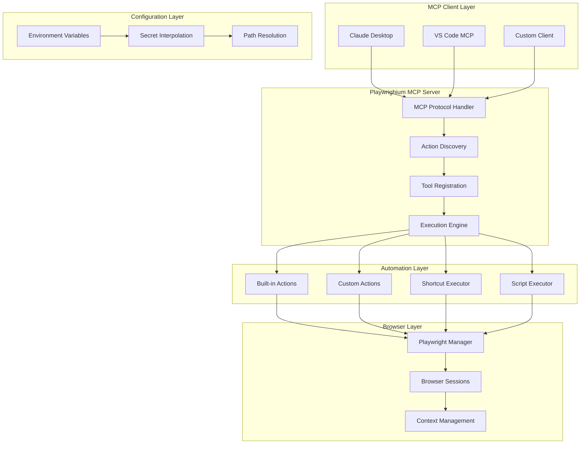

# Architecture - How Playwrighium Works

Deep dive into Playwrighium's internal architecture, design decisions, and system components.

## 🏗️ System Overview



## 🎯 Core Design Principles

### 1. **Separation of Concerns**
Each layer has a specific responsibility:
- **MCP Layer**: Protocol communication and tool discovery
- **Automation Layer**: Business logic and workflow execution
- **Browser Layer**: Playwright management and browser control
- **Configuration Layer**: Environment and secret management

### 2. **Plugin Architecture**
- **Built-in Actions**: Core functionality always available
- **Custom Actions**: User-defined tools loaded dynamically
- **Executors**: Specialized runners for shortcuts and scripts
- **Hot Reloading**: Changes detected without server restart

### 3. **Persistent Sessions**
- Browser instances persist across tool calls
- Reduces startup overhead for sequential operations
- Maintains authentication state and cookies
- Optional cleanup with `close-browser` action

### 4. **Environment Isolation**
- Each action runs in isolated execution context
- Environment variables scoped appropriately
- Secrets interpolated safely at runtime
- Base directory management for file operations

## 📦 Component Architecture

### MCP Server Core (`src/index.ts`)

```typescript
// Main server initialization
const server = new McpServer({
  name: 'playwrighium',
  version: '0.1.0',
  description: 'Reusable Playwright shortcuts via MCP'
});

// Discovery and registration pipeline
const builtinActions = await loadActionsFrom(BUILTIN_ACTIONS_DIR);
const userActions = await loadActionsFrom(USER_ACTIONS_DIR);
registerActions(server, [...builtinActions, ...userActions]);
```

**Responsibilities:**
- MCP protocol handling and communication
- CLI argument parsing and configuration
- Action discovery from filesystem
- Tool registration with proper schemas
- Execution coordination and error handling

### Action Discovery System

```typescript
// Dynamic action loading
async function loadActionsFrom(dir: string): Promise<LoadedAction[]> {
  const entries = await fs.readdir(dir, { withFileTypes: true });
  const actions: LoadedAction[] = [];

  for (const entry of entries) {
    if (isSupportedActionFile(entry.name)) {
      const definition = await importActionDefinition(path.join(dir, entry.name));
      actions.push({ definition, filePath, relativePath });
    }
  }

  return actions;
}
```

**Features:**
- Automatic TypeScript/JavaScript module loading
- Hot-reloading support for development
- Error isolation (one bad action doesn't break others)
- Metadata tracking for debugging

### Browser Management

```typescript
// Persistent browser session management
let persistentBrowser: Browser | null = null;
let persistentContext: BrowserContext | null = null;
let persistentPage: Page | null = null;

async function runAction(action: LoadedAction, args: any) {
  // Reuse or create browser session
  if (persistentBrowser && persistentContext && persistentPage) {
    // Reuse existing session
  } else {
    // Create new session
    browser = await browserType.launch({ headless });
    context = await browser.newContext();
    page = await context.newPage();
  }
}
```

**Benefits:**
- **Performance**: Avoid browser startup overhead
- **State Preservation**: Maintain login sessions and cookies
- **Resource Efficiency**: Single browser for multiple operations
- **Cleanup Control**: Explicit session management

### Secret Management Pipeline

```typescript
// Multi-stage secret interpolation
function interpolateSecrets(text: string): string {
  return text.replace(/\$\{\{([^}]+)\}\}/g, (_, varName) => {
    const value = process.env[varName.trim()];
    if (value === undefined) {
      throw new Error(`Environment variable "${varName}" not defined`);
    }
    return value;
  });
}

// Deep object interpolation
function interpolateSecretsInObject(obj: any): any {
  if (typeof obj === 'string') return interpolateSecrets(obj);
  if (Array.isArray(obj)) return obj.map(interpolateSecretsInObject);
  if (obj && typeof obj === 'object') {
    const result: any = {};
    for (const key in obj) {
      result[key] = interpolateSecretsInObject(obj[key]);
    }
    return result;
  }
  return obj;
}
```

**Security Features:**
- Environment variable validation
- Safe interpolation with error handling
- Recursive object processing
- No secret logging or exposure

## 🎨 Action Execution Flow

### 1. **Tool Call Reception**
```typescript
server.registerTool(action.name, toolDefinition, async (args, extra) => {
  return runAction(action, args, server, extra.sessionId);
});
```

### 2. **Input Validation**
```typescript
// Zod schema validation
const validatedInput = action.inputSchema?.parse?.(args) || args;
```

### 3. **Secret Interpolation**
```typescript
const interpolatedArgs = interpolateSecretsInObject(validatedInput);
```

### 4. **Browser Session Management**
```typescript
// Get or create browser session
const { browser, context, page } = await getBrowserSession(action);
```

### 5. **Action Execution**
```typescript
const result = await action.run({
  browser, context, page,
  input: interpolatedArgs,
  logger, env, interpolateSecrets, baseDir
}, { playwright });
```

### 6. **Result Normalization**
```typescript
return normalizeActionResult(action.name, result);
```

## 🔧 Built-in Action Architecture

### Browser Session Action
The foundational action that powers command execution:

```typescript
// Unified command processing
for (const cmd of input.commands) {
  switch (cmd.type) {
    case 'navigate':
      await page.goto(cmd.url);
      break;
    case 'click':
      const locator = await getLocator(page, cmd.selector);
      await locator.click();
      break;
    // ... 25+ command types
  }
}
```

**Smart Selector Resolution:**
```typescript
async function getLocator(page: Page, selector: string) {
  // CSS selectors
  if (selector.match(/^[.#[]/) || selector.includes('>')) {
    return page.locator(selector);
  }

  // Role-based: role:button[Submit]
  const roleMatch = selector.match(/^role:(\w+)(?:\[(.+)\])?$/);
  if (roleMatch) {
    const [, role, name] = roleMatch;
    return page.getByRole(role, name ? { name } : {});
  }

  // Test ID: testid:login-form
  if (selector.startsWith('testid:')) {
    return page.getByTestId(selector.replace('testid:', ''));
  }

  // Default to text content
  return page.getByText(selector);
}
```

### Shortcut Executor
YAML workflow execution:

```typescript
// YAML parsing with secret interpolation
const yamlContent = fs.readFileSync(resolvedPath, 'utf-8');
const interpolatedYaml = interpolateSecrets(yamlContent);
const shortcutData = yaml.parse(interpolatedYaml);

// Command execution loop
for (const cmd of shortcutData.commands) {
  await executeCommand(page, cmd, logger);
}
```

### Script Executor
TypeScript/JavaScript runtime:

```typescript
// Dynamic script loading with TypeScript support
if (resolvedPath.endsWith('.ts')) {
  require('ts-node').register({
    transpileOnly: true,
    compilerOptions: { module: 'commonjs' }
  });
}

const scriptModule = require(resolvedPath);
const scriptFn = scriptModule.default || scriptModule;

// Execution with rich context
const result = await scriptFn({
  page, context, browser, args,
  logger, env, interpolateSecrets, playwright
});
```

## 🔄 Data Flow Patterns

### Request Processing Pipeline

```
MCP Client Request
    ↓
Tool Name Resolution
    ↓
Action Definition Lookup
    ↓
Input Schema Validation
    ↓
Secret Interpolation
    ↓
Browser Session Acquisition
    ↓
Action Context Creation
    ↓
User Code Execution
    ↓
Result Normalization
    ↓
MCP Response
```

### Browser Lifecycle Management

```
Server Startup
    ↓
First Action Call
    ↓ (creates)
Browser Launch
    ↓
Context Creation
    ↓
Page Creation
    ↓ (persists)
Subsequent Actions
    ↓ (reuses same session)
close-browser Action
    ↓ (explicitly closes)
Browser Cleanup
```

### Configuration Resolution

```
CLI Arguments
    ↓ (overrides)
Environment Variables
    ↓ (overrides)
Default Values
    ↓ (merged into)
Runtime Configuration
    ↓ (used by)
Action Execution
```

## 🎛️ Configuration System

### Path Resolution Logic
```typescript
function parseCliOptions(): CliOptions {
  // Priority order: CLI args > env vars > defaults
  let actionRoot =
    process.env.PLAYWRIGHIUM_ACTIONS_DIR ??
    process.env.PLAYWRIGHIUM_ROOT ??
    undefined;

  let baseDir =
    process.env.PLAYWRIGHIUM_BASE_DIR ??
    process.env.PLAYWRIGHIUM_PROJECT ??
    undefined;

  // Apply CLI overrides
  // ... CLI parsing logic

  // Resolve relative paths
  const resolvedBase = path.resolve(baseDir ?? process.cwd());
  const resolvedActions = actionRoot && actionRoot.length > 0
    ? path.isAbsolute(actionRoot)
      ? path.normalize(actionRoot)
      : path.resolve(resolvedBase, actionRoot)
    : path.join(resolvedBase, '.playwright-mcp');

  return { actionRoot: resolvedActions, baseDir: resolvedBase };
}
```

### Environment Loading
```typescript
// Load .env from repository root
loadDotenv({ path: path.join(BASE_DIR, '.env') });

// Make available to actions
const context = {
  env: process.env as Record<string, string | undefined>,
  interpolateSecrets,
  baseDir: BASE_DIR
};
```

## 🔍 Error Handling Strategy

### Layered Error Handling

1. **Action Level**: User code error handling
2. **Execution Level**: Browser and runtime errors
3. **Server Level**: MCP protocol and system errors
4. **Client Level**: User-facing error messages

```typescript
async function runAction(action: LoadedAction, args: any) {
  try {
    const result = await action.definition.run(context, helpers);
    return normalizeActionResult(action.definition.name, result);
  } catch (error) {
    const message = error instanceof Error ? error.message : String(error);
    await logger(`Action failed: ${message}`, 'error');

    return {
      content: [{ type: 'text', text: `Action ${action.definition.name} failed: ${message}` }],
      isError: true
    };
  }
}
```

### Graceful Degradation
- Action failures don't crash the server
- Browser session recovery on connection loss
- Partial results returned when possible
- Detailed error context for debugging

## 📊 Performance Considerations

### Browser Session Optimization
- **Connection Pooling**: Reuse browser instances
- **Context Isolation**: Separate contexts for different workflows
- **Resource Blocking**: Skip images/CSS for data extraction
- **Parallel Execution**: Multiple pages in same context

### Memory Management
```typescript
// Resource cleanup patterns
try {
  // Action execution
} finally {
  if (!persistent) {
    await page?.close();
    await context?.close();
    await browser?.close();
  }
}
```

### TypeScript Compilation
```typescript
// Lazy TypeScript compilation
async function ensureTsRuntime() {
  if (tsRuntimeRegistered) return;

  process.env.TS_NODE_COMPILER_OPTIONS = JSON.stringify({
    module: 'CommonJS',
    moduleResolution: 'node',
    esModuleInterop: true
  });

  await import('ts-node/register/transpile-only');
  tsRuntimeRegistered = true;
}
```

## 🔒 Security Architecture

### Principle of Least Privilege
- Actions run in isolated contexts
- File system access limited to project directory
- Network access controlled by browser security model
- Environment variables scoped appropriately

### Secret Management
- Secrets never logged or exposed in error messages
- Interpolation happens at runtime, not storage
- Environment variables validated before use
- `.env` files excluded from version control

### Input Validation
```typescript
// Zod schema validation at action boundaries
const inputShape = normalizeInputSchema(action.definition.inputSchema);
server.registerTool(action.definition.name, {
  inputSchema: inputShape
}, async (args) => {
  // Args are pre-validated by MCP framework
  return runAction(action, args);
});
```

## 🚀 Extensibility Points

### Custom Action Interface
```typescript
interface PlaywrightActionDefinition<TSchema> {
  name: string;
  title?: string;
  description?: string;
  browser?: BrowserEngine;
  headless?: boolean;
  contextOptions?: BrowserContextOptions;
  inputSchema?: TSchema;
  run: (ctx: ActionContext<T>, helpers: Helpers) => Promise<ActionRunResult>;
}
```

### Plugin Architecture Benefits
- **Zero Configuration**: Actions auto-discovered
- **Hot Reloading**: Changes reflected immediately
- **Type Safety**: Full TypeScript support
- **Flexible Returns**: Multiple result formats supported

### Integration Points
- **MCP Protocol**: Standard interface for AI clients
- **Playwright API**: Full browser automation capabilities
- **Node.js Ecosystem**: Access to all npm packages
- **File System**: Read/write configuration and results

## 🔄 Future Architecture Considerations

### Scalability Improvements
- **Action Caching**: Compiled action definitions
- **Browser Pooling**: Multiple persistent sessions
- **Distributed Execution**: Remote browser coordination
- **Result Streaming**: Large dataset handling

### Enhanced Security
- **Sandboxed Execution**: Isolated action runtime
- **Permission System**: Granular access control
- **Audit Logging**: Action execution tracking
- **Secret Rotation**: Automated credential updates

### Developer Experience
- **Action Templates**: Scaffolding for common patterns
- **Debug Mode**: Enhanced logging and inspection
- **Testing Framework**: Action unit testing
- **Documentation Generation**: Auto-generated API docs

## 🎯 Design Trade-offs

### Persistence vs. Isolation
**Choice**: Persistent browser sessions by default
- ✅ **Pro**: Faster execution, maintained state
- ❌ **Con**: Potential state pollution between actions
- **Mitigation**: Explicit cleanup actions available

### TypeScript vs. Runtime Flexibility
**Choice**: TypeScript compilation with fallback to JavaScript
- ✅ **Pro**: Type safety and IDE support
- ❌ **Con**: Compilation overhead
- **Mitigation**: Transpile-only mode for speed

### Auto-discovery vs. Configuration
**Choice**: Automatic action discovery from filesystem
- ✅ **Pro**: Zero configuration, easy development
- ❌ **Con**: Less control over loading order
- **Mitigation**: Clear naming conventions and error handling

This architecture provides a solid foundation for scalable, maintainable browser automation while preserving the simplicity that makes Playwrighium powerful for users at all levels.

## 🚀 Next Steps

- **[Best Practices](./10-best-practices.md)** - Patterns for robust automation
- **[API Reference](./12-api-reference.md)** - Complete interface documentation
- **[Custom Actions](./04-custom-actions.md)** - Build your own automation tools
- **[Troubleshooting](./13-troubleshooting.md)** - Debug architecture issues